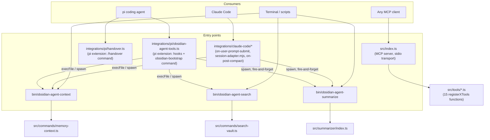
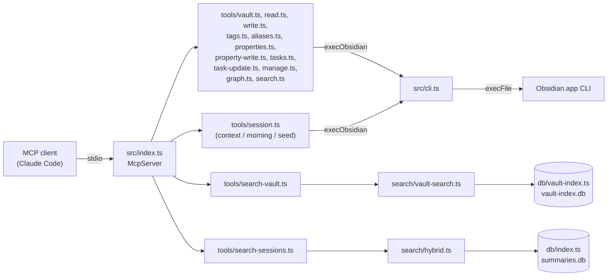
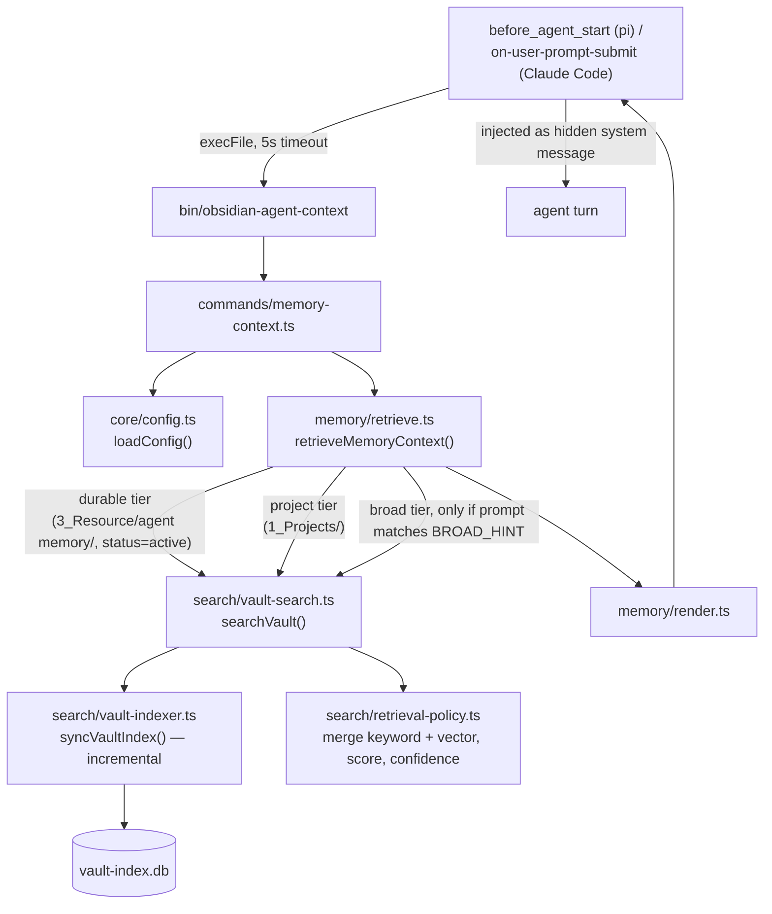
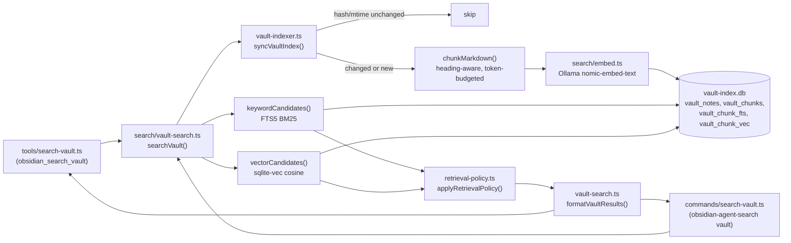
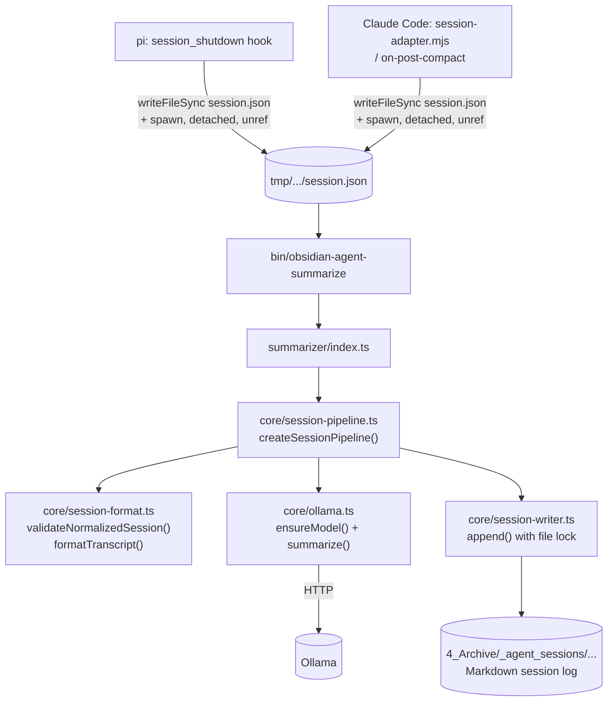

# Architecture

This document maps the current shape of `obsidian-agent-tools`: entry points, the
files each entry point calls into, and the runtime flows that connect them.
It's a snapshot, not a design target — see the codebase itself for ground truth
as it evolves.

## Entry points

The project exposes four independent front doors. None of them go through a
shared "app" object — each is a small script that imports directly from `src/`.

**Why two front doors (CLI binaries and MCP)?** They serve different
integration mechanisms, not indecision — pi's hooks shell out to a plain
subprocess and read stdout; Claude Code's MCP client speaks the MCP
tool-calling protocol. Both binaries and MCP tools call into the same
`src/` library code underneath (`search/vault-search.ts`, `memory/retrieve.ts`,
`core/config.ts`).

## Module map

| Directory | Responsibility |
|---|---|
| `src/tools/` | MCP tool registrations (`registerXTools(server)`). Most are thin wrappers over `cli.ts` (`execObsidian`) for vault CRUD (`vault.ts`, `read.ts`, `write.ts`, `tags.ts`, `aliases.ts`, `properties.ts`, `property-write.ts`, `tasks.ts`, `task-update.ts`, `manage.ts`, `graph.ts`, `search.ts`). `session.ts`, `search-vault.ts`, `search-sessions.ts` are the exceptions — they hold real logic (see flows below). |
| `src/commands/` | CLI-entry logic invoked by the `bin/` scripts: `memory-context.ts` (memory retrieval), `search-vault.ts` (vault search + status). |
| `src/core/` | Config (`config.ts`, the `AgentConfig` seam) and the session-summarization pipeline (`session-pipeline.ts`, `session-format.ts`, `session-writer.ts`, `ollama.ts`). |
| `src/search/` | Vault semantic/keyword search stack: `embed.ts` (Ollama embeddings), `vault-indexer.ts` (chunk + sync to SQLite), `vault-search.ts` (query + merge + format), `retrieval-policy.ts` (candidate scoring/confidence), `rewrite.ts` (query cleanup). Also `hybrid.ts`, a second, separate hybrid-search implementation for the legacy session-summaries store. |
| `src/memory/` | Automatic memory-context retrieval: `retrieve.ts` (tiered durable/project/broad search), `render.ts` (Markdown rendering), `types.ts`. |
| `src/db/` | Two SQLite-backed stores: `vault-index.ts` (vault chunks, FTS5 + `vec0`, used by the search stack) and `index.ts` (legacy `summaries.db`, FTS5 + `vec0`, used only by `tools/search-sessions.ts`). |
| `src/summarizer/` | Entry point that turns a raw session transcript into a written summary via `core/session-pipeline.ts`. |
| `src/cli.ts` | `execObsidian()` — shells out to the actual Obsidian.app CLI for vault reads/writes. |
| `integrations/pi/` | pi extension: memory-context injection hook, session-shutdown summarization hook, `obsidian-bootstrap` command, `/handover` command. |
| `integrations/claude-code/` | Claude Code hook scripts, functionally mirroring the pi extension's two hooks. |

## Flow: MCP server tool dispatch

`tools/session.ts`'s `seed` action is the one tool that mixes concerns: it
calls `execObsidian` for reads/backlinks/links, then does its own in-handler
graph traversal (BFS over depth 1–2, dedupe, budget) and Markdown assembly —
271 lines in one handler for three actions (`context`, `morning`, `seed`).

## Flow: automatic memory-context retrieval

Triggered before every agent turn (pi's `before_agent_start`, Claude Code's
`on-user-prompt-submit`).

## Flow: vault search (interactive)

`formatVaultResults()` and `loadConfig()` are the two shared seams both
adapters call through — as of the latest refactor, neither adapter
reimplements config resolution or result formatting locally.

## Flow: session summarization

Triggered on session end (pi `session_shutdown` with `reason: "quit"`, Claude
Code's `session-adapter.mjs`/`on-post-compact`).

Both hooks are fire-and-forget: the parent process (`pi` or Claude Code)
never waits for the summarizer to finish.

## Duplication already known

Two structural duplications are tracked but not yet resolved — see the
architecture review from 2026-07-29 for the full before/after analysis:

- **Two hybrid-search stacks.** `search/hybrid.ts` + `db/index.ts` (session
  summaries) and `search/vault-search.ts` + `db/vault-index.ts` (vault chunks)
  independently wire FTS5 + `vec0` + embedding storage for the same underlying
  problem. `docs/migration-from-claude-obsidian.md` already frames the vault
  stack as "the generalized successor" — consolidating them into one
  hybrid-search interface with two corpus adapters is the stated direction,
  not a new idea.
- **`tools/session.ts` is a shallow dispatcher with a deep algorithm buried
  inside it.** The `seed` action's graph traversal (backlinks/outlinks,
  depth 1–2, dedupe, budget) has no seam of its own — it can only be
  exercised through the full MCP call surface. Extracting a
  `buildGraphContext()` module would let it be tested directly.
